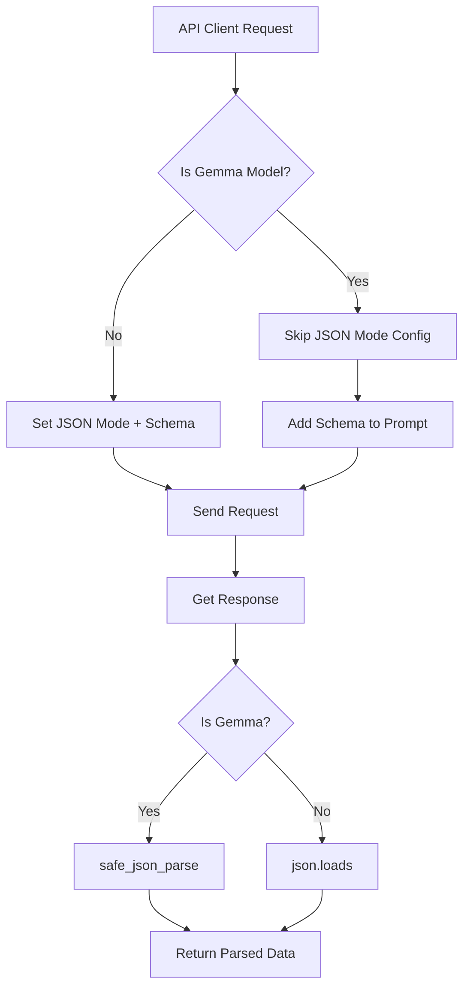

# Support Gemma Models Without Native JSON Mode

## Problem

The `gemma-3-12b-it` model offers 15k RPD (vs 20 RPD for Gemini) but doesn't support native JSON mode. We need to:

1. Detect gemma models and skip JSON mode configuration
2. Add JSON schemas to prompts for instruction-based JSON generation
3. Safely parse potentially malformed JSON responses

## Solution Architecture



## Implementation Plan

### 1. Add Utility Function for Safe JSON Parsing

**File**: [`NodeRAG/utils/json_parser.py`](NodeRAG/utils/json_parser.py) (new file)Create a robust JSON parser that:

- Handles markdown code blocks (```json...```)
- Cleans invisible unicode characters
- Returns None on parse failure (for error handling)
```python
def safe_json_parse(json_str):
    """Safely parse JSON from LLM responses with error handling"""
    # Remove markdown, clean unicode, parse JSON
    # Return None on failure
```


### 2. Add JSON Schema to Prompt Converter

**File**: [`NodeRAG/utils/prompt/schema_to_prompt.py`](NodeRAG/utils/prompt/schema_to_prompt.py) (new file)Create function to convert Pydantic schemas to prompt instructions:

- `text_decomposition` → Detailed list-of-dicts structure with example
- `relationship_reconstraction` → Single dict with source/relationship/target
- `High_level_element` → List of title/description dicts
- `decomposed_text` → Simple list of strings
```python
def schema_to_prompt_instruction(schema_model) -> str:
    """Convert Pydantic BaseModel to JSON schema instruction text"""
    # Return formatted schema description for prompt
```


### 3. Modify Gemini LLM Class

**File**: [`NodeRAG/LLM/LLM.py`](NodeRAG/LLM/LLM.py)**Changes needed in `Gemini` class**:**A. Add model detection helper**:

```python
def _is_gemma_model(self) -> bool:
    """Check if current model is a Gemma model (no JSON mode support)"""
    return 'gemma' in self.model_name.lower()
```

**B. Modify `_create_completion()` method (lines 282-309)**:

- Check if gemma model
- If gemma: don't set `response_mime_type` or `response_schema`
- If not gemma: keep current behavior with JSON mode

**C. Modify `_create_completion_async()` method (lines 315-340)**:

- Same logic as synchronous version

**D. Update response parsing**:

- After getting `response.text`, check if gemma model
- If gemma: use `safe_json_parse(response.text)`
- If not gemma: use `json.loads(response.text)` as before

### 4. Update Prompt Templates

**Files**:

- [`NodeRAG/utils/prompt/text_decomposition.py`](NodeRAG/utils/prompt/text_decomposition.py)
- [`NodeRAG/utils/prompt/relationship_reconstraction.py`](NodeRAG/utils/prompt/relationship_reconstraction.py)
- [`NodeRAG/utils/prompt/community_summary.py`](NodeRAG/utils/prompt/community_summary.py)
- [`NodeRAG/utils/prompt/decompose.py`](NodeRAG/utils/prompt/decompose.py)

**Add schema instructions at the end of each prompt**:Example for `text_decomposition_prompt`:

```python
text_decomposition_prompt = """
[... existing prompt ...]

OUTPUT FORMAT:
You MUST respond with valid JSON matching this exact structure:
{{
  "Output": [
    {{
      "semantic_unit": "string - paraphrased summary",
      "entities": ["ENTITY1", "ENTITY2"],
      "relationships": ["ENTITY_A, relation, ENTITY_B"]
    }}
  ]
}}

Respond with ONLY the JSON, no markdown formatting or explanations.
"""
```

### 5. Update Prompt Manager

**File**: [`NodeRAG/utils/prompt/prompt_manager.py`](NodeRAG/utils/prompt/prompt_manager.py)**Modify to conditionally append schema instructions**:

- Add `model_name` parameter to `__init__`
- Add helper method `_should_add_schema_to_prompt()` 
- Modify property getters to append schema instructions for gemma models
```python
class prompt_manager():
    def __init__(self, language: str, model_name: str):
        self.language = language
        self.model_name = model_name
    
    def _is_gemma_model(self) -> bool:
        return 'gemma' in self.model_name.lower()
    
    @property
    def text_decomposition(self):
        base_prompt = # ... get base prompt
        if self._is_gemma_model():
            # Append schema instruction
            base_prompt += schema_to_prompt_instruction(text_decomposition)
        return base_prompt
```


Apply the same pattern to all prompt properties:

- `text_decomposition`
- `relationship_reconstraction`
- `community_summary`
- `decompose_query`
- `attribute_generation` (if it uses JSON)

### 6. Update NodeConfig Initialization

**File**: [`NodeRAG/config/Node_config.py`](NodeRAG/config/Node_config.py)

**Line 194**: Change prompt_manager initialization to pass model_name:

```python
# OLD:
self.prompt_manager = prompt_manager(self._language)

# NEW:
self.prompt_manager = prompt_manager(self._language, self.model_config['model_name'])
```

### 7. Update Schema Instruction Templates

Create schema instructions for each JSON format:

**Text Decomposition Schema**:

```
OUTPUT FORMAT:
You MUST respond with valid JSON matching this exact structure:
{
  "Output": [
    {
      "semantic_unit": "string - paraphrased summary of the semantic unit",
      "entities": ["ENTITY1", "ENTITY2", "..." - list of UPPERCASE entity names],
      "relationships": ["ENTITY_A, relation description, ENTITY_B" - list of 3-part relationship strings]
    }
  ]
}

Respond with ONLY the JSON object above, no markdown code blocks or explanations.
```

**Relationship Reconstruction Schema**:

```
OUTPUT FORMAT:
Respond with valid JSON in this exact structure:
{
  "source": "ENTITY_A",
  "relationship": "RELATION_TYPE",
  "target": "ENTITY_B"
}

Output ONLY the JSON object, no markdown formatting.
```

**High-Level Elements Schema**:

```
OUTPUT FORMAT:
Respond with valid JSON in this exact structure:
{
  "high_level_elements": [
    {
      "title": "string - concise title",
      "description": "string - detailed description"
    }
  ]
}

Output ONLY the JSON object, no markdown formatting.
```

**Decomposed Text Schema**:

```
OUTPUT FORMAT:
Respond with valid JSON in this exact structure:
{
  "elements": ["element1", "element2", "..."]
}

Output ONLY the JSON object, no markdown formatting.
```

## Implementation Order

1. **Step 1**: Create `json_parser.py` with `safe_json_parse()` function
2. **Step 2**: Create `schema_to_prompt.py` with schema instruction generators
3. **Step 3**: Update all prompt template files to include schema instructions
4. **Step 4**: Update `prompt_manager.py` to accept `model_name` and conditionally append schemas
5. **Step 5**: Update `Gemini` class in `LLM.py` to detect Gemma and conditionally use JSON mode
6. **Step 6**: Update `NodeConfig` to pass `model_name` to `prompt_manager`
7. **Step 7**: Test with `models/gemma-3-12b-it`

## Files to Create/Modify

**New Files**:

- [`NodeRAG/utils/json_parser.py`](NodeRAG/utils/json_parser.py) - Safe JSON parsing utility
- [`NodeRAG/utils/prompt/schema_to_prompt.py`](NodeRAG/utils/prompt/schema_to_prompt.py) - Schema instruction generators

**Modified Files**:

- [`NodeRAG/LLM/LLM.py`](NodeRAG/LLM/LLM.py) - Add Gemma detection and conditional JSON mode
- [`NodeRAG/utils/prompt/text_decomposition.py`](NodeRAG/utils/prompt/text_decomposition.py) - Add schema to prompts
- [`NodeRAG/utils/prompt/relationship_reconstraction.py`](NodeRAG/utils/prompt/relationship_reconstraction.py) - Add schema to prompts
- [`NodeRAG/utils/prompt/community_summary.py`](NodeRAG/utils/prompt/community_summary.py) - Add schema to prompts
- [`NodeRAG/utils/prompt/decompose.py`](NodeRAG/utils/prompt/decompose.py) - Add schema to prompts
- [`NodeRAG/utils/prompt/prompt_manager.py`](NodeRAG/utils/prompt/prompt_manager.py) - Accept model_name, conditionally append schemas
- [`NodeRAG/config/Node_config.py`](NodeRAG/config/Node_config.py) - Pass model_name to prompt_manager
- [`NodeRAG/utils/__init__.py`](NodeRAG/utils/__init__.py) - Export `safe_json_parse`

## Testing Plan

1. **Test with Gemini model** (baseline - should work exactly as before):

   - Set `model_name: gemini-1.5-flash-8b` in config
   - Run graph build for user_14
   - Verify no regressions

2. **Test with Gemma model**:

   - Set `model_name: models/gemma-3-12b-it` in config
   - Run graph build for user_14
   - Check logs for successful JSON parsing
   - Verify graph nodes are created correctly

3. **Error handling**:

   - Verify that malformed JSON responses are caught by `safe_json_parse`
   - Check error.log for any parsing issues

## Backward Compatibility

All changes are **100% backward compatible**:

- Gemini models continue to use native JSON mode (no changes in behavior)
- Only Gemma models get the new prompt-based schema approach
- If `safe_json_parse` fails, error handling already in place will cache the error

## Rate Limit Benefits

After implementation:

- **Gemini models**: 20 RPD (unchanged)
- **Gemma models**: 15,000 RPD (750x improvement!)

This allows much faster graph building without hitting rate limits.