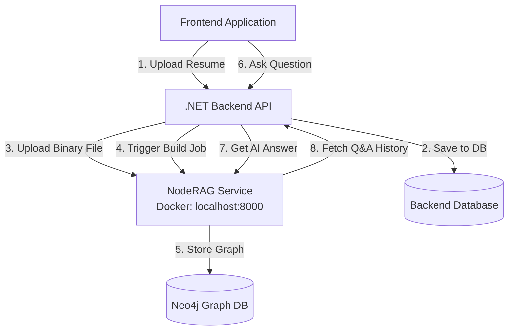
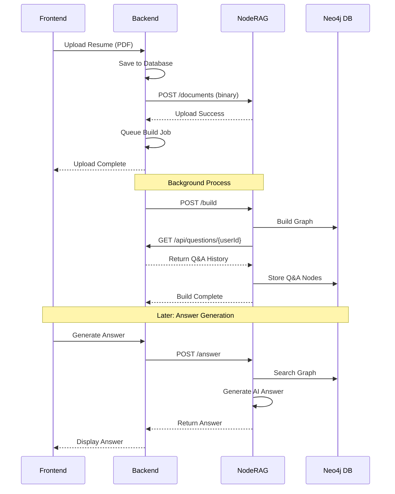

# NodeRAG Backend Integration Specification

## 1. Overview

### What is NodeRAG?

NodeRAG is a knowledge graph-based AI service that processes resumes and job application data to:
- Build semantic knowledge graphs from user documents (resumes, CVs)
- Store historical Q&A pairs from job applications
- Generate personalized answers to job application questions using RAG (Retrieval-Augmented Generation)
- Provide semantic search across user's professional background

### Architecture



### Integration Goals

The .NET backend must:
1. **Upload user resumes** to NodeRAG as binary files (PDF, DOCX, TXT)
2. **Trigger graph builds** in the background when resumes are uploaded
3. **Synchronize Q&A pairs** to NodeRAG when users submit job application answers
4. **Generate AI answers** for application questions using the user's knowledge graph
5. **Provide Q&A history** to NodeRAG via an authenticated endpoint

---

## 2. NodeRAG Service Information

### Base Configuration

- **Service URL**: `http://localhost:8000` (configurable)
- **Docker Container**: `noderag-api`
- **Authentication**: API Key via `X-API-Key` header
- **Timeout**: 120 seconds recommended
- **Protocol**: REST API (JSON)

### Multi-User Support

NodeRAG supports multi-tenancy through `user_id` parameter. All operations are isolated per user.

---

## 3. NodeRAG API Endpoints

### 3.1 Upload Document (Binary File)

**Endpoint**: `POST /documents`

**Purpose**: Upload user's resume as a binary file (PDF, DOCX, TXT). NodeRAG will extract text automatically.

**Authentication**: `X-API-Key: {your_api_key}`

**Request Format**: `multipart/form-data`

**Form Fields**:
- `file` (required): Binary file upload
- `document_type` (optional): "resume" | "job_description" | "general" (default: "resume")
- `user_id` (required): User identifier (string)
- `filename` (optional): Custom filename

**Response** (200 OK):
```json
{
  "success": true,
  "message": "Document uploaded successfully",
  "document": {
    "filename": "john_doe_resume.pdf",
    "path": "/app/POC_Data/documents/users/user_123/input/john_doe_resume.pdf",
    "size_bytes": 245678,
    "created_at": "2024-01-15T10:30:00Z",
    "document_type": "resume",
    "user_id": "123"
  },
  "requires_rebuild": true
}
```

**cURL Example**:
```bash
curl -X POST http://localhost:8000/documents \
  -H "X-API-Key: your_api_key" \
  -F "file=@resume.pdf" \
  -F "user_id=123" \
  -F "document_type=resume"
```

---

### 3.2 Trigger Graph Build

**Endpoint**: `POST /build`

**Purpose**: Trigger the knowledge graph build process. This analyzes documents and creates the semantic graph.

**Authentication**: `X-API-Key: {your_api_key}`

**Request Body**:
```json
{
  "user_id": "123",
  "incremental": true,
  "sync_to_neo4j": true,
  "force_rebuild": false
}
```

**Fields**:
- `user_id` (required): User to build graph for
- `incremental` (optional, default: true): Only process new documents if true
- `sync_to_neo4j` (optional, default: true): Sync to Neo4j database
- `force_rebuild` (optional, default: false): Clear cache and rebuild from scratch

**Response** (200 OK):
```json
{
  "success": true,
  "message": "Build completed successfully",
  "build_id": "a1b2c3d4",
  "status": "completed",
  "duration_seconds": 45.2,
  "nodes_created": 1247,
  "edges_created": 3891,
  "neo4j_synced": true
}
```

**Build Duration**: 30-60 seconds typically

**Note**: This is a synchronous operation. For production, trigger it as a background job.

---

### 3.3 Check Build Status

**Endpoint**: `GET /build/{build_id}/status`

**Purpose**: Check the status of an ongoing or completed build.

**Authentication**: `X-API-Key: {your_api_key}`

**Response** (200 OK):
```json
{
  "success": true,
  "message": "Build status retrieved",
  "status": "running",
  "current_stage": "Embedding pipeline",
  "stages_completed": [
    "INIT",
    "Document pipeline",
    "Text pipeline",
    "Graph pipeline"
  ],
  "error_details": null
}
```

**Status Values**: "pending" | "running" | "completed" | "failed"

---

### 3.4 Generate AI Answer

**Endpoint**: `POST /answer`

**Purpose**: Generate a personalized answer to a job application question using the user's knowledge graph.

**Authentication**: `X-API-Key: {your_api_key}`

**Request Body**:
```json
{
  "query": "Why are you interested in this backend developer role?",
  "user_id": "123",
  "job_context": "Senior Backend Developer at TechCorp. Requirements: 5+ years C#/.NET experience...",
  "top_k": 10
}
```

**Fields**:
- `query` (required): The question to answer
- `user_id` (required): User identifier
- `job_context` (optional): Job description for context-aware answers
- `top_k` (optional, default: 10): Number of graph nodes to retrieve

**Response** (200 OK):
```json
{
  "success": true,
  "message": "Answer generated",
  "query": "Why are you interested in this backend developer role?",
  "answer": "I'm particularly drawn to this backend developer role because...",
  "search_results": {
    "nodes": [
      {
        "hash_id": "abc123",
        "node_type": "entity",
        "text": "Senior .NET Developer at Microsoft",
        "weight": 0.92
      }
    ],
    "qa_pairs": [
      {
        "question": "What motivated you to work in backend development?",
        "answer": "My passion for building scalable systems...",
        "similarity": 0.85
      }
    ],
    "total_count": 25
  },
  "processing_time_ms": 1250
}
```

---

### 3.5 Search Knowledge Graph

**Endpoint**: `POST /search`

**Purpose**: Search the knowledge graph without generating an answer (retrieval only).

**Authentication**: `X-API-Key: {your_api_key}`

**Request Body**:
```json
{
  "query": "machine learning projects",
  "user_id": "123",
  "top_k": 10
}
```

**Response**: Similar to `/answer` but without the `answer` field.

---

### 3.6 Create Q&A Pair

**Endpoint**: `POST /qa-pairs`

**Purpose**: Add a question-answer pair to the user's knowledge graph (incrementally, no rebuild needed).

**Authentication**: `X-API-Key: {your_api_key}`

**Request Body**:
```json
{
  "question": "Describe a challenging bug you fixed",
  "answer": "In my role at TechCorp, I encountered a race condition...",
  "question_id": "q_789",
  "user_id": "123",
  "job_title": "Senior Backend Developer",
  "company_name": "TechCorp",
  "submission_date": "2024-01-15T10:30:00Z"
}
```

**Response** (200 OK):
```json
{
  "success": true,
  "message": "Q&A pair created successfully",
  "question_hash_id": "hash_q_abc123",
  "answer_hash_id": "hash_a_def456",
  "question": "Describe a challenging bug you fixed",
  "answer": "In my role at TechCorp...",
  "added_to_graph": true
}
```

**Important**: This adds the Q&A pair directly to Neo4j without rebuilding the entire graph.

---

### 3.7 Bulk Create Q&A Pairs

**Endpoint**: `POST /qa-pairs/bulk`

**Purpose**: Create multiple Q&A pairs at once.

**Authentication**: `X-API-Key: {your_api_key}`

**Request Body**:
```json
{
  "qa_pairs": [
    {
      "question": "...",
      "answer": "...",
      "user_id": "123"
    }
  ],
  "sync_to_neo4j": true
}
```

---

### 3.8 Health Check

**Endpoint**: `GET /health`

**Purpose**: Check if NodeRAG service is running and healthy.

**Authentication**: None required

**Response** (200 OK):
```json
{
  "success": true,
  "message": "NodeRAG API is running",
  "status": {
    "api_status": "healthy",
    "neo4j_connected": true,
    "graph_loaded": true,
    "search_ready": true,
    "total_nodes": 15234,
    "total_relationships": 48791
  }
}
```

---

### 3.9 Get Graph Statistics

**Endpoint**: `GET /graph/stats`

**Purpose**: Get statistics about the user's knowledge graph.

**Authentication**: `X-API-Key: {your_api_key}`

**Response** (200 OK):
```json
{
  "success": true,
  "message": "Statistics retrieved",
  "total_nodes": 1247,
  "total_edges": 3891,
  "node_type_distribution": {
    "entity": 245,
    "text": 512,
    "question": 45,
    "answer": 45
  },
  "documents_count": 3,
  "qa_pairs_count": 45
}
```

---

## 4. Backend Requirements

### 4.1 Endpoint to Provide: GET /api/questions/user/{userId}

**Purpose**: NodeRAG needs to fetch historical Q&A pairs for a user during graph builds.

**Authentication**: Bearer token (provided by NodeRAG via `Authorization: Bearer {token}`)

**What Backend Must Do**:
1. Validate the Bearer token from NodeRAG (configured token)
2. Fetch all Q&A pairs for the specified user from database
3. Return in the expected format

**Expected Response Format**:
```json
[
  {
    "question_id": "q_123",
    "question": "Why do you want to work here?",
    "answer": "I'm excited about this opportunity because...",
    "job_title": "Senior Developer",
    "company_name": "TechCorp",
    "submission_date": "2024-01-15T10:30:00Z"
  }
]
```

**Required Fields**:
- `question_id` (string)
- `question` (string)
- `answer` (string)
- `job_title` (string, can be null)
- `company_name` (string, can be null)
- `submission_date` (string, ISO 8601 format)

---

### 4.2 Resume Upload Flow

**When**: User uploads a resume in the frontend

**Backend Must**:
1. Receive the file upload (PDF, DOCX, TXT)
2. Validate file (size ≤ 10MB, allowed extensions)
3. Save resume metadata to backend database
4. Upload the binary file to NodeRAG `/documents` endpoint
5. Queue a background job to call `/build` endpoint
6. Return success response immediately (don't wait for build)

**Background Job**:
- Call `POST /build` with `user_id` and `incremental=true`
- Poll `GET /build/{buildId}/status` every 5 seconds
- Update build status in backend database
- Max timeout: 10 minutes

---

### 4.3 Q&A Synchronization Flow

**When**: User submits an answer to a job application question

**Backend Must**:
1. Save Q&A pair to backend database
2. Queue a background job to sync to NodeRAG
3. Call `POST /qa-pairs` with the Q&A data
4. Log success/failure

**Important**: This sync happens asynchronously - don't block the user's response.

---

### 4.4 AI Answer Generation Flow

**When**: User requests AI-generated answer for an application question

**Backend Must**:
1. Receive question and optional job description from frontend
2. Call NodeRAG `POST /answer` endpoint with user_id, query, and job_context
3. Return the generated answer and search results to frontend
4. Handle timeouts gracefully (120 second timeout)

---

## 5. Configuration Requirements

### Backend Configuration (appsettings.json)

```json
{
  "NodeRAG": {
    "BaseUrl": "http://localhost:8000",
    "ApiKey": "{secure_api_key}",
    "BackendAuthToken": "{token_for_noderag_to_call_backend}",
    "TimeoutSeconds": 120,
    "MaxRetries": 3
  }
}
```

### Environment Variables

For production, use environment variables or secrets management:
- `NODERAG_API_KEY`: API key for calling NodeRAG
- `BACKEND_AUTH_TOKEN`: Token that NodeRAG uses to call backend

---

## 6. Error Handling

### HTTP Status Codes

| Code | Meaning | Backend Action |
|------|---------|----------------|
| 200 | Success | Process response |
| 400 | Bad Request | Log error, show user-friendly message |
| 401 | Unauthorized | Check API key configuration |
| 404 | Not Found | User graph doesn't exist - trigger build first |
| 413 | File Too Large | Reject file, show size limit error |
| 500 | Server Error | Log error, retry with backoff |
| 503 | Service Unavailable | NodeRAG is down, queue for retry |

### Retry Strategy

For network errors and 500/503 responses:
- Retry up to 3 times
- Exponential backoff: 1s, 2s, 4s
- Log all retry attempts

---

## 7. Security

### API Key Management

- Store NodeRAG API key securely (Azure Key Vault, AWS Secrets Manager, User Secrets)
- Never commit keys to source control
- Rotate keys periodically

### Backend Auth Token

- Generate a secure random token for NodeRAG to authenticate
- Validate in the `GET /api/questions/user/{userId}` endpoint
- Check header: `Authorization: Bearer {token}`

### User Data Isolation

- Always pass `user_id` in requests to NodeRAG
- Validate user ownership before making NodeRAG calls
- Ensure users can only access their own data

### File Upload Security

- Validate file extensions: .pdf, .docx, .txt only
- Max file size: 10MB
- Consider virus scanning (optional: ClamAV integration)

---

## 8. Testing Checklist

### Integration Tests Required

1. **Resume Upload Flow**
   - Upload PDF → NodeRAG receives file → Build triggers → Status updates
   
2. **Q&A Synchronization**
   - Save answer → NodeRAG receives Q&A pair → Pair appears in graph

3. **Answer Generation**
   - Request answer → NodeRAG returns response → Frontend displays answer

4. **Multi-User Isolation**
   - User A's data doesn't appear in User B's results

5. **Authentication**
   - Invalid API key → 401 error
   - Invalid Bearer token → 401 error on questions endpoint

6. **Error Handling**
   - NodeRAG down → Graceful degradation
   - Timeout → Proper error message

---

## 9. Deployment Checklist

### Before Deployment

- [ ] Configure NodeRAG base URL in appsettings
- [ ] Set API key in environment variables
- [ ] Set Backend auth token in environment variables
- [ ] Test health endpoint: `GET http://noderag:8000/health`
- [ ] Verify Neo4j is running and accessible
- [ ] Test end-to-end: upload resume → build → answer question

### Monitoring

- Add health check for NodeRAG service
- Monitor build queue length
- Alert on build failures
- Track API response times

---

## 10. Support & Troubleshooting

### Common Issues

**"Graph not found" (404)**
- User hasn't uploaded a resume yet
- Build hasn't completed
- Solution: Trigger build with `POST /build`

**"Service unavailable" (503)**
- NodeRAG Docker container is down
- Neo4j is not accessible
- Solution: Check Docker status, restart services

**Slow answer generation**
- Large knowledge graphs take longer
- Network latency
- Solution: Implement proper timeout handling, show loading state

**Build failures**
- API quota exceeded (Google Gemini)
- Document parsing errors
- Solution: Check error logs, retry with different model

---

## 11. Quick Start Example

### Minimum Viable Integration

```http
### 1. Upload Resume
POST http://localhost:8000/documents
X-API-Key: your_api_key
Content-Type: multipart/form-data

file=@resume.pdf
user_id=123

### 2. Build Graph
POST http://localhost:8000/build
X-API-Key: your_api_key
Content-Type: application/json

{
  "user_id": "123",
  "incremental": true,
  "sync_to_neo4j": true
}

### 3. Generate Answer
POST http://localhost:8000/answer
X-API-Key: your_api_key
Content-Type: application/json

{
  "query": "Why are you interested in this role?",
  "user_id": "123",
  "job_context": "Senior Developer position at TechCorp"
}
```

---

## Appendix: Data Flow Summary



---

**Document Version**: 1.0  
**Last Updated**: December 2024  
**NodeRAG Version**: Custom Build with Neo4j Integration

